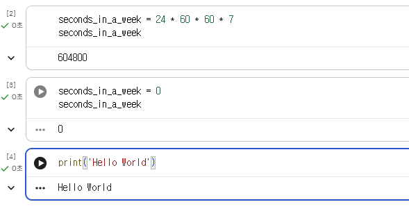
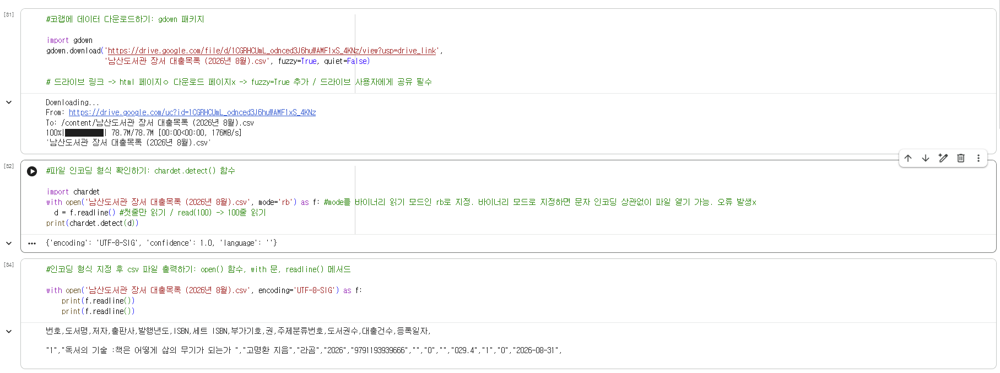
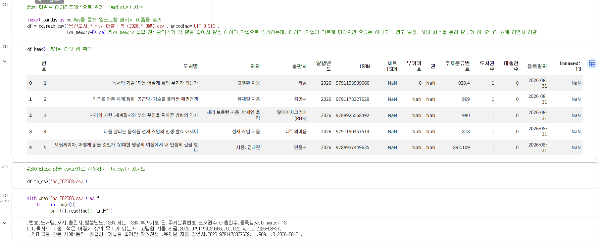
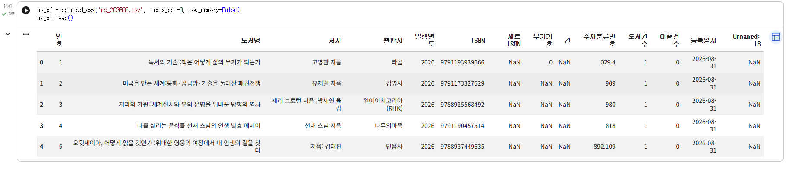

# 데이터분석 1주차 정규과제

📌데이터분석 정규과제는 매주 정해진 분량의 『*혼자 공부하는 데이터 분석 with 파이썬*』 을 읽고 학습하는 것입니다. 이번 주는 아래의 **DataAnalysis_1st_TIL**에 나열된 분량을 읽고 공부하시면 됩니다.

아래의 문제를 풀어보며 학습 내용을 점검하세요. 문제를 해결하는 과정에서 개념을 스스로 정리하고, 필요한 경우 제시된 강의를 참고하여 보완하는 것이 좋습니다.

<!-- 강의 링크는 아래와 같습니다.
https://www.youtube.com/watch?v=qGE_rT_oQaQ&list=PLVsNizTWUw7FGzSRCkQrPEEe-ljVXgS7k
https://www.youtube.com/watch?v=tp9XmeaHU0E&list=PLVsNizTWUw7FGzSRCkQrPEEe-ljVXgS7k&index=2
https://www.youtube.com/watch?v=D46j-e_IHlI&list=PLVsNizTWUw7FGzSRCkQrPEEe-ljVXgS7k&index=3
-->


## DataAnalysis_1st_TIL

### 1장 데이터 분석을 시작하며
#### 01. 데이터 분석이란
#### 02. 구글 코랩과 주피터 노트북
#### 03. 이 도서가 얼마나 인기가 좋을까요?


## Study Schedule

| 주차  | 공부 범위     | 완료 여부 |
| ----- | ------------- | --------- |
| 1주차 | p.24~81    | ✅         |
| 2주차 | p.84~151   | 🍽️         |
| 3주차 | p.154~219  | 🍽️         |
| 4주차 | p.222~279 | 🍽️         |
| 5주차 | p.282~325 | 🍽️         |
| 6주차 | p.328~379 | 🍽️         |
| 7주차 | p.382~430 | 🍽️         |

<br>

<!-- 여기까진 그대로 둬 주세요-->


# 1️⃣ 개념 정리 

## 01. 데이터 분석이란

**데이터 분석** 

- 비교적 소규모
- 올바른 의사 결정을 돕기 위한 통찰을 제공하는 데 초점을 둠
- 기술통계, 탐색적 데이터 분석(EDA), 가설검정
   - 기술통계: 관측/실험 -> 데이터 정량화 및 요약 Ex. 평균, 최솟값, 최댓값 찾기
   - 탐색적 데이터 분석: 데이터를 시각화(Ex. 그래프) 후 분석
   - 가설검정: 특정 가정의 합당성 평가

**데이터 과학**

- 대규모
- 한 걸음 더 나아가 문제 해결을 위한 최선의 솔루션을 만드는 데 초점을 둠
- 통계학, 데이터 분석, 머신러닝, 데이터 마이닝을 포함하는 큰 개념

**데이터 분석가**

- 필요 역량: 프로그래밍 기술 + 수학 및 통계 지식 + 도메인 지식(for 비즈니스 적용)
- 작업 과정: 좁은 의미의 데이터 분석(기탐가) + 넓은 의미의 데이터 분석(데이터 수집/처리/정제 및 모델링)

**데이터 분석을 위한 도구** = 소프트웨어(<-프로그래밍 언어)

1. 프로그래밍 언어: 파이썬, R (SQL-> 데이터가 데이터베이스 형태로 있다면 사용 가능)
- 파이썬: 표준 언어 취급, 머신러닝 관련 패키지를 다루기 용이
- R: 통계 관련 패키지를 다루기 용이, 데이터 수집, 전처리 등은 까다롭

2. 파이썬 필수 패키지(라이브러리) to PyPI ... R to CRAN
- 넘파이 NumPy : 다차원 배열 for 과학계산
- 판다스 pandas : 데이터프레임(숫자+문자->표) for 데이터 처리 및 분석
- 맷플롯립 matplotlib : 데이터 시각화
- 사이파이 SciPy : 수학 과학 계산 Ex. 미분, 적분, 확률, 선형대수, 최적화...
- 사이킷런 scikit-learn : for 머신러닝 (넘파이, 사이파이에 의존ㅇ)

3. 프로그래밍 환경: 구글 코랩

외)  
데이터 마이닝(Mining): 데이터에서 패턴이나 지식을 추출하는 작업 for 사람의 의사결정  
머신러닝: 데이터에서 자동으로 규칙을 학습하여(by 컴퓨터) 문제를 해결하는 소프트웨어(=모델)를 만드는 기술 (딥러닝이 머신러닝 알고리즘의 한 종류)


## 02. 구글 코랩과 주피터 노트북

구글 코랩: 클라우드 웹 온라인 버전, 온라인 에디터
주피터 노트북: 내 컴퓨터 오프라인 버전

**구글 코랩** 

- 노트북/코랩 메모장: 코랩 파일(ipynb)
- 셀: 코드 셀(셀 하나 실행 시 Ctrl+Enter / 연속 셀 실행 시 Shift+Enter / 실행 순서 주의)  
  vs 텍스트 셀(마크다운, HTML 혼용 사용 가능)
- 깃허브에서 불러오기 가능


## 03. 이 도서가 얼마나 인기가 좋을까요?

**데이터 찾기** to 공공데이터포털 ... 원하는 데이터를 찾기 쉽지 않을 때

**코랩에서 데이터 확인 및 분석**

- csv 파일: 한 줄이 하나의 레코드(row)로, 레코드는 콤마로 구분된 여러 필드(coloum)로 구성됨 ;comma separated values(메모장 연결할 시 확인 가능)
- 파이썬에서는 그냥 엑셀 말고 csv 쓰자  

- gdown(), open(), readline(), chardet.detect(), 
- 인코딩: 문자 인코딩은 컴퓨터가 이해할 수 있는 0과 1의 이진(binary) 형태로 바꾸는 것 Ex. UTF-8, EUC-KR  

- read_csv(), head(), to_csv()  
- 데이터 프레임, 시리즈(같은 데이터 타입의 한 줄), 데이터타입(정수형, 문자열...)


# 2️⃣ 수행 인증







<br>
<br>

# 3️⃣ 확인 문제

## 문제 1.

> **🧚Q. 데이터 분석의 개념을 넓은 의미와 좁은 의미로 나누어 설명하고, 두 개념의 차이점도 함께 정리해주세요.**


```
데이터 분석은 좁은 개념에서 기술통계, 탐색적 데이터 분석, 가설검증을 포함한다. 기술통계는 관측이나 실험을 통해 데이터를 정량화 및 요약하는 것으로 평균, 최솟값, 최댓값 등을 찾는 것을 의미한다. 탐색적 데이터 분석은 그래프 등으로 데이터를 시각화 한 후 분석을 진행하는 방식이다. 가설검정은 특정 가정을 설정한 후 해당 가설의 합당성을 평가하는 분석 과정이다. 

다만 데이터의 분석가의 경우 이러한 좁은 개념에서의 데이터 분석 뿐만 아니라 넓은 의미에서의 데이터 분석까지 모두 총괄한다. 넓은 의미의 데이터 분석은 데이터의 수집, 처리, 정제 및 모델링을 포함한다. 즉 데이터 분석가는 이미 구해진 데이터를 단순히 분석하는 것 뿐만 아니라, 데이터를 직접 수집하고, 결과를 도출해내는 작업까지 모두 가능해야 하는 것이다. 
```


### 🎉 수고하셨습니다.
