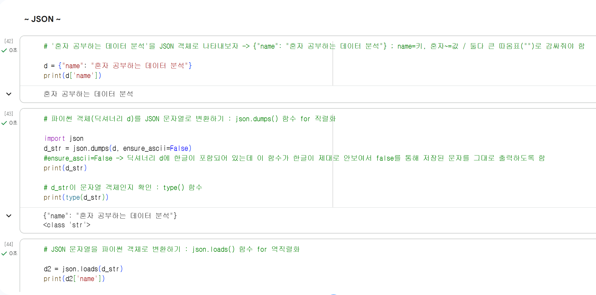
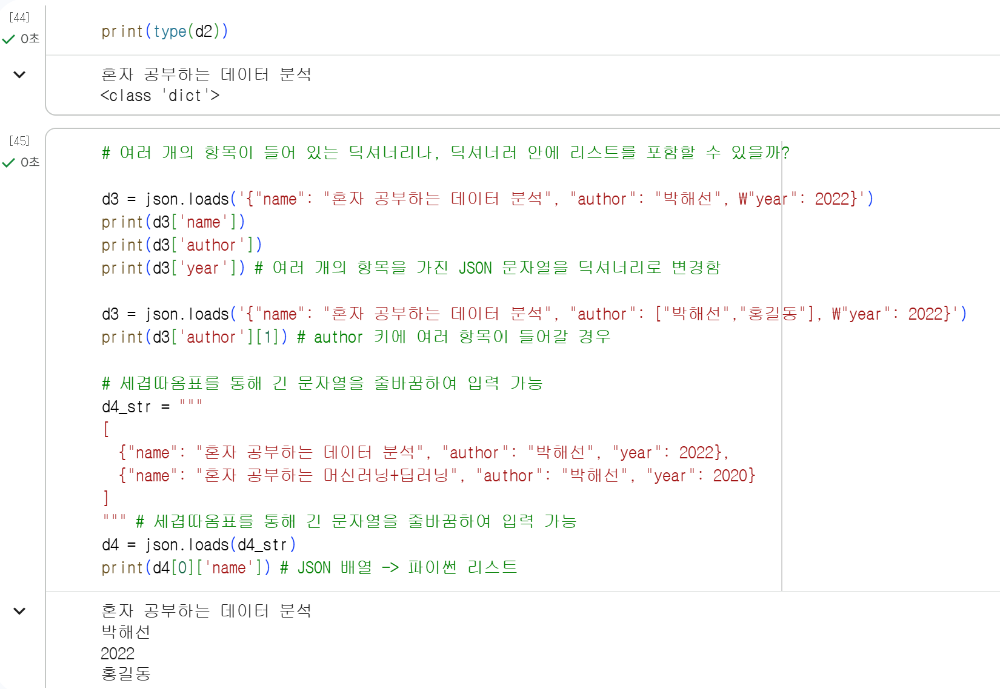
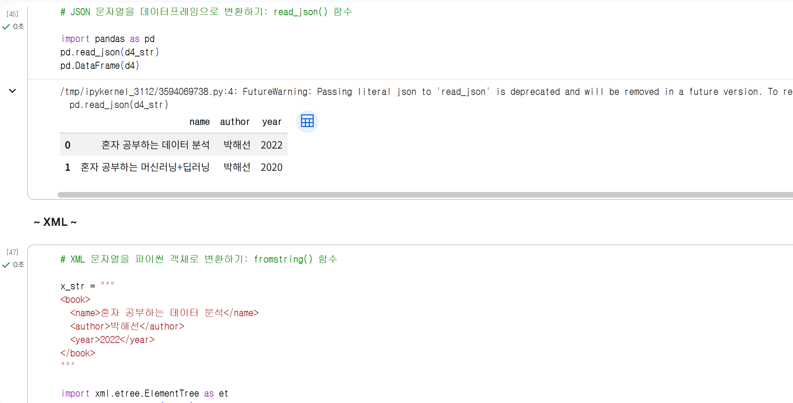
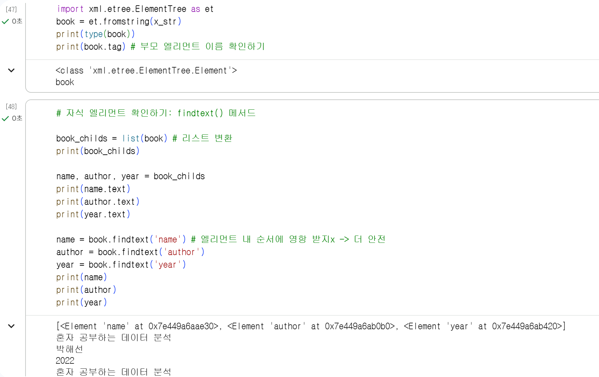
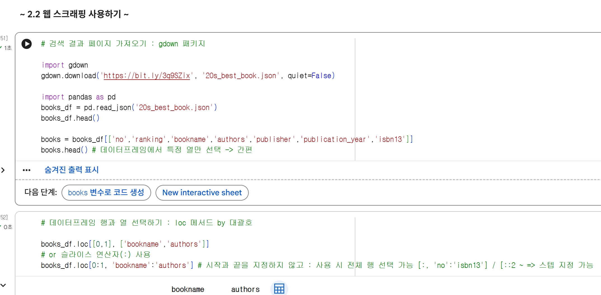
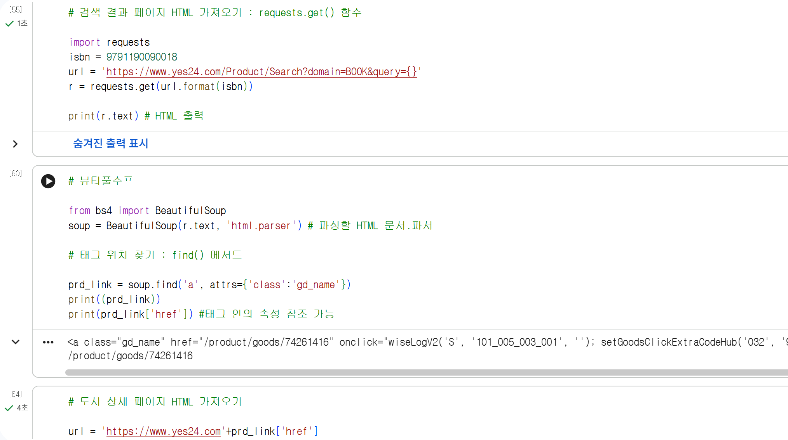

# 데이터분석 2주차 정규과제

📌데이터분석 정규과제는 매주 정해진 분량의 『*혼자 공부하는 데이터 분석 with 파이썬*』 을 읽고 학습하는 것입니다. 이번 주는 아래의 **DataAnalysis_2nd_TIL**에 나열된 분량을 읽고 공부하시면 됩니다.

아래의 문제를 풀어보며 학습 내용을 점검하세요. 문제를 해결하는 과정에서 개념을 스스로 정리하고, 필요한 경우 제시된 강의를 참고하여 보완하는 것이 좋습니다.

<!-- 강의 링크는 아래와 같습니다.
https://www.youtube.com/watch?v=s_-VvTLb3gs&list=PLVsNizTWUw7FGzSRCkQrPEEe-ljVXgS7k&index=4
https://www.youtube.com/watch?v=Il6L8OtNFpc&list=PLVsNizTWUw7FGzSRCkQrPEEe-ljVXgS7k&index=5
-->


## DataAnalysis_2nd_TIL

### 2장 데이터 수집하기
#### 01. API 사용하기
#### 02. 웹 스크래핑 사용하기


## Study Schedule

| 주차  | 공부 범위     | 완료 여부 |
| ----- | ------------- | --------- |
| 1주차 | p.24~81    | ✅         |
| 2주차 | p.84~151   | ✅         |
| 3주차 | p.154~219  | 🍽️         |
| 4주차 | p.222~279 | 🍽️         |
| 5주차 | p.282~325 | 🍽️         |
| 6주차 | p.328~379 | 🍽️         |
| 7주차 | p.382~430 | 🍽️         |

<br>

<!-- 여기까진 그대로 둬 주세요-->


# 1️⃣ 개념 정리 

## 01. API 사용하기

**API** = Application Programming Interface

- 두 프로그램이 서로 대화하기 위한 방법(데이터 요청-전송)
- DB의 접근이 어려울 때(권한 등의 문제) 인증된 URL을 통해 필요한 데이터에 접근하는 방식
- 공공 데이트 세트는 API를 사용하는 경우가 많음

------------------------------------------

**1. HTTP** = Hyper Text Transfer Protocol

```
웹 사이트는 웹 페이지를 서비스하기 위해 웹 서버 소프트웨어를 사용함.  
이런 웹 서버 프로그램은 웹 브라우저와 통신할 때 HTTP란 프로토콜을 사용함.   
HTTP는 인터넷에서 웹 페이지를 전송하는 기본 통신 방법임.  웹 브라우저가 웹 서버에 웹 페이지를 요청하고(HTTP), 웹 서버는 요청에 맞는 웹 페이지를 웹 브라우저에게 전송함(HTML).  
웹 서버는 네이버 같은 웹 사이트에서 운영하고, 웹 브라우저는 내 컴퓨터에 설치되어 있음.
```
- 웹 사이트 = 네이버, 유튜브 같은 개념/서비스 개념 그 자체 / 여러 웹 페이지가 포함됨(ex. 뉴스 페이지, 쇼핑 페이지..)
- 웹 페이지 = 브라우저 화면의 한 장의 페이지. 그 속에 HTML(뼈대/제목, 문단, 버튼 등 구조) + CSS(스타일/색깔, 배치, 디자인) + JavaScript(동작-버튼 누르면 반응하는 등의 기능) + 이미지/영상 등 미디어 파일 ...
- 웹 서버 = 이런 서비스를 돌리는 컴퓨터/프로그램
- 웹 브라우저 = 크롬, 사파리 같은 프로그램. 서버로 요청을 보내기도 하고, 응답받은 HTML을 우리가 보기 좋게 해석(렌더링)해주기도 한다.

=> 웹 브라우저(손님)에서 웹 서버(식당)에 HTTP(배달원, 배달 방식)을 통해 HTML(음식)을 받아온다.

**2. HTML** = Hypertext Markup Language

- 웹 브라우저가 화면에 표시할 수 있는 문서의 한 종류이자 웹 페이지를 위한 표준 언어. 
- 크롬 브라우저에서 [마우스 오른쪽 버튼 -> 페이지 소스 보기]를 통해서 해당 웹 페이지의 HTML 내용 보기 가능
- 마크업: HTML 같은 언어 / 태그: <태그> 와 같은 꺽쇠 표시

------------------------------------------
다시 API로 (위는 방식의 유사성만을 설명)   

```
웹 기반 API는 웹 서버와 웹 브라우저가 대화하는 방식과 비슷함.   
HTTP 프로토콜을 사용하지만, HTML이 아니라 일반적으로 CSV, JSON, XML 같은 (텍스트)파일을 사용함.
```
=> 주문한 음식이 달라졌다.   
=> API는 프로그램 사이의 대화 방식을 결정함. 다양한 API 중 HTTP 프로토콜을 사용하는 웹 기반 API가 가장 널리 사용됨. 

**1. JSON** = JavaScript Object Notation

- 원래는 자바스트립트 언어를 위해 만들어졌지만... 지금은 그냥 범용 사용 가능함.
- 파이썬의 딕셔너리와 리스트를 중첩해 놓은 것과 비슷하다.
- 프로그램 B가 프로그램 A에게 HTTP(배달방법)을 통해 데이터를 요청하면, A는 가지고 있는 파이썬 객체를 json.dumps()를 통해 텍스트 파일(JSON)로 전달하고, B는 그걸 받고 json.loads()를 통해 다시 파이썬 객체로 변환한다.

**2. XML** = eXtensible Markup Language
- 부모 엘리먼트 아래에 자식 엘리먼트 ; 계층적 구조의 엘리먼트
- 각 엘리먼트는 시작 태그 <>와 종료 태그 </>가 붙여짐

**API를 호출하는 URL 작성하기**

- HTTP GET 방식: 파라미터=문자, 파라미터&파라미터, 호출 URL?파라미터 ... 연결 방식
- 이후 인증키 얻어 호출 URL 가장 마지막 부분에 덧붙이기  
외) **requests 패키지** 사용
- get() 함수; API 주소를 데이터로 확인
- json() 메서드; 파이썬 객체로 변환 -> 이후 데이터프레임 변환

## 02.웹 스크래핑 사용하기

**웹 스크래핑 / 웹 크롤링**

- 데이터 소스를 사용할 수 없고 원하는 데이터가 인터넷 웹 페이지에 있다면 직접 HTML의 내용을 읽어 원하는 정보는 추출해내야 함.
- 프로그램으로 웹사이트의 페이지를 옮겨 가면서 데이터를 추출하는 작업 (선: requests 패키지를 통해 웹사이트 HTML 가져오기)

**뷰티풀수프** 로 HTML에서 데이터 추출하기

- requests -> 웹의 API를 호출했다면, 뷰티풀수프 -> HTML 안에 있는 내용 찾기  
외)
- f12 -> 개발자도구 열기
- 파서: 입력 데이터를 받아 데이터 구조를 만드는 소프트웨어 라이브러리 -> 파싱 (ex. json 패키지라는 파서를 통해 JSON 파일을 만들어내는 과정인 파싱)

**웹 스크래핑 시 주의할 점**
- robots.txt 파일응ㄹ 통해 웹사이트의 스크래핑 허용 여부 확인
- HTML 태그의 특정 가능성 확인 -> 웹 스크래핑은 최후의 수단으로 

# 2️⃣ 수행 인증








<br>
<br>

# 3️⃣ 확인 문제

## 문제 1.

> **🧚Q. 다음 중 BeautifulSoup 외에 웹 스크래핑에 사용할 수 있는 파이썬 패키지로 가장 적절한 것은 무엇인가요?**

```
1️⃣ NumPy  
2️⃣ Scrapy  
3️⃣ Matplotlib  
4️⃣ Scikit-learn  
```

```
2번 Scrapy입니다. Scrapy는 requests와 BeautifulSoup를 합쳐 놓은 것과 비슷한 도구입니다. 이미 있는 데이터를 활용 및 분석 하는 데 쓰이는 1, 2, 4번 도구와 비교했을 때 데이터를 가져오는 역할을 하는 데 있어 Scrapy가 가장 적합합니다.
```


### 🎉 수고하셨습니다.
