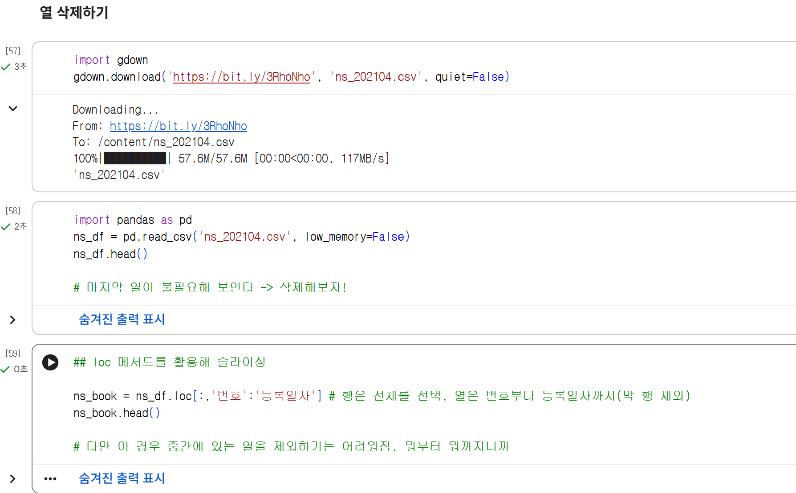
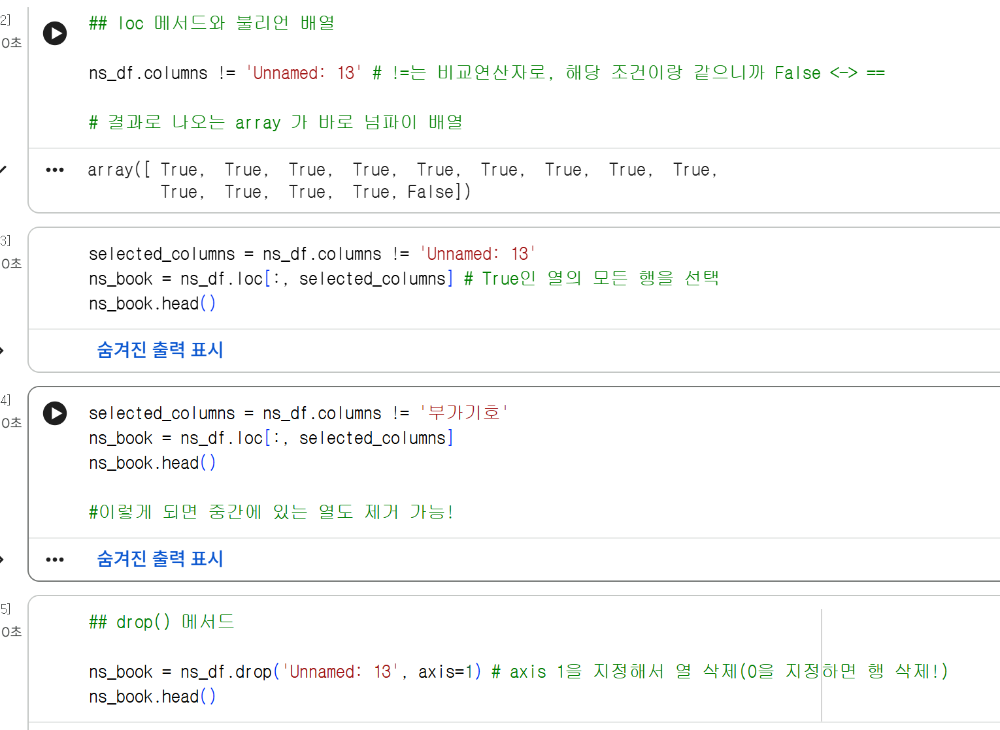
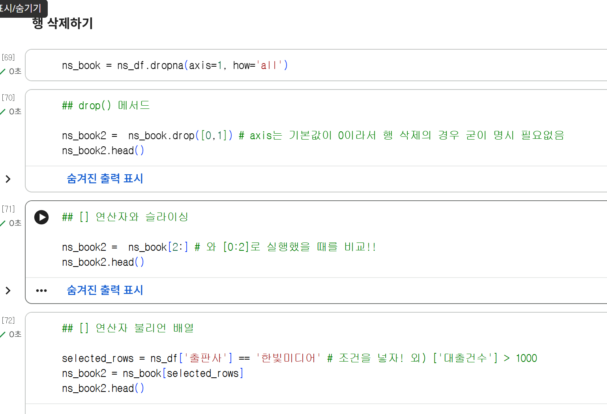
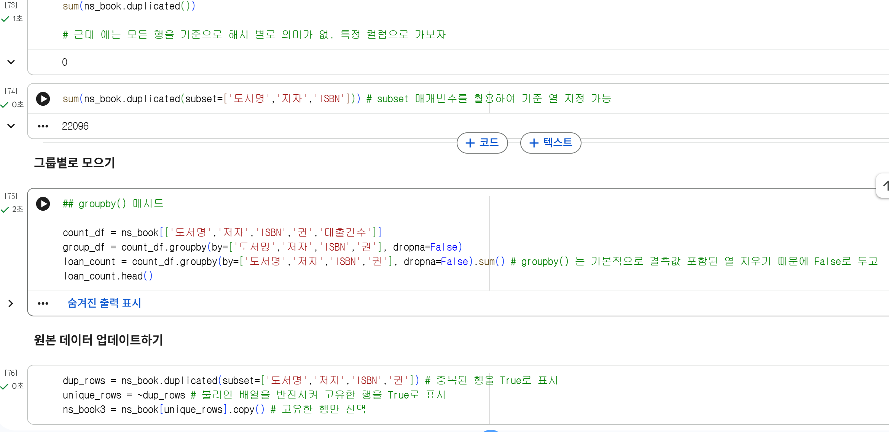
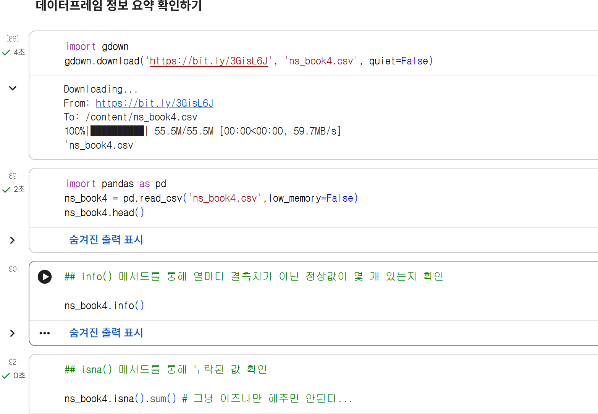
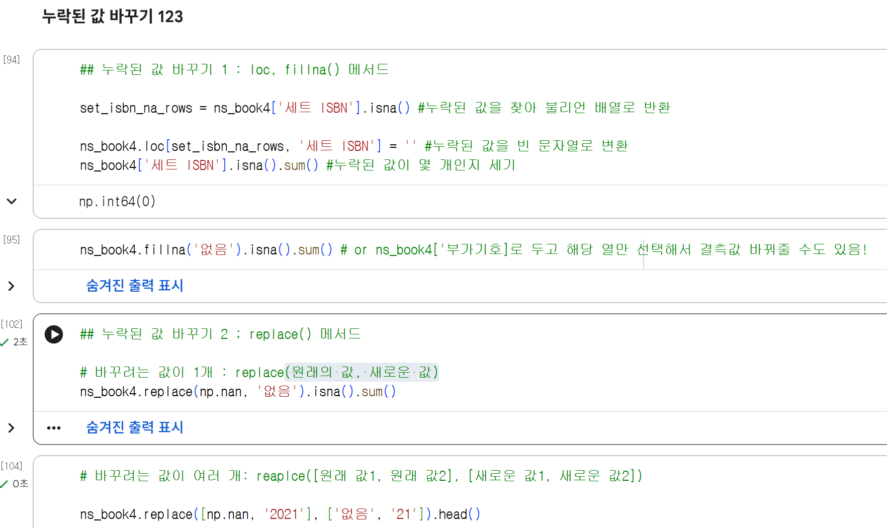
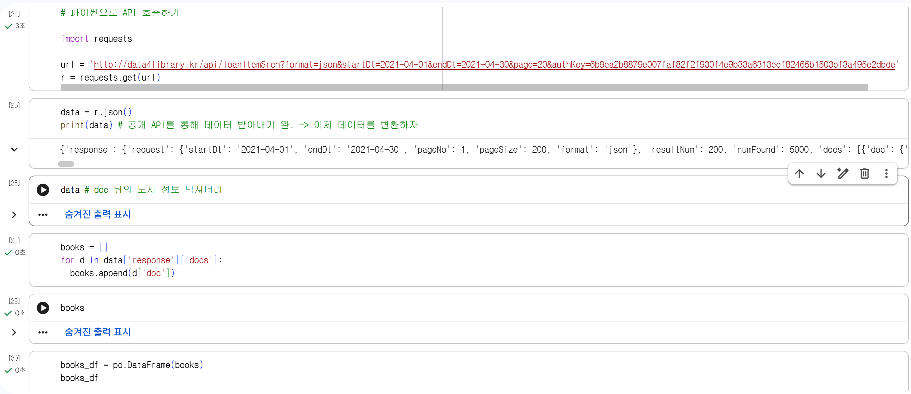

# 데이터분석 3주차 정규과제

📌데이터분석 정규과제는 매주 정해진 분량의 『*혼자 공부하는 데이터 분석 with 파이썬*』 을 읽고 학습하는 것입니다. 이번 주는 아래의 **DataAnalysis_3rd_TIL**에 나열된 분량을 읽고 공부하시면 됩니다.

아래의 문제를 풀어보며 학습 내용을 점검하세요. 문제를 해결하는 과정에서 개념을 스스로 정리하고, 필요한 경우 제시된 강의를 참고하여 보완하는 것이 좋습니다.

<!-- 강의 링크는 아래와 같습니다.
https://www.youtube.com/watch?v=CE3_InvbmLY&list=PLVsNizTWUw7FGzSRCkQrPEEe-ljVXgS7k&index=6
https://www.youtube.com/watch?v=hhbzUEQWdTg&list=PLVsNizTWUw7FGzSRCkQrPEEe-ljVXgS7k&index=7
-->


## DataAnalysis_3rd_TIL

### 3장 데이터 정제하기
#### 01. 불필요한 데이터 삭제하기
#### 02. 잘못된 데이터 수정하기


## Study Schedule

| 주차  | 공부 범위     | 완료 여부 |
| ----- | ------------- | --------- |
| 1주차 | p.24~81    | ✅         |
| 2주차 | p.84~151   | ✅         |
| 3주차 | p.154~219  | ✅         |
| 4주차 | p.222~279 | 🍽️         |
| 5주차 | p.282~325 | 🍽️         |
| 6주차 | p.328~379 | 🍽️         |
| 7주차 | p.382~430 | 🍽️         |

<br>

<!-- 여기까진 그대로 둬 주세요-->


# 1️⃣ 개념 정리 

## 01. 불필요한 데이터 삭제하기

- 데이터 정제: 데이터에서 손상되거나 부정확한 부분을 수정하고, 불필요한 데이터를 삭제하거나 불완전한 값을 교체하는 등의 작업 -> 데이터 랭글링, 데이터 먼징   
-> 판다스 데이터 프레임의 여러 기능 익히기

**열 삭제하기**
- loc 메서드 슬라이싱 -> 인덱스로 특정 범위 내에서만 가능
- 불리언 배열 및 drop() -> 지정 후 중간 열도 삭제 가능
- dropna() -> 결측값 있는 열 제거 가능

**행 삭제하기**
- drop() 
- [] 연산자를 통한 슬라이싱
- [] 연사자와 불리언 배열 -> 조건 추가

**중복된 행 찾기**
- duplicated() + subset으로 기준 지정

**그룹별로 모으기**
- groupby() -> 결측값 미삭제 주의

**원본 데이터 업데이트하기**
- update() 후 reset_index() -> 업데이트. 리셋 후 인덱스 재설정


## 02. 잘못된 데이터 수정하기

-> NaN을 확인하는 방법 및 결측값 채우는 방법

**데이터 프레임 정보 요약 확인하기**
- info()로 정상치들 확인 / isna() +sum() 으로 결측치 확인
- None 과 astype() / -> np.nan to NaN

**누락된 값 바꾸기 123**
- loc, fillna() -> 빈 문자열로 변환 후, 열 선택후 해당 열만 변환 가능
-  replace() -> 바꾸려는 값이 
    - 1개(원래의 값, 새로운 값)
    - 2개 이상([원래 값1, 원래 값2]
    - [새로운 값1][새로운 값2]), 열 마다({열 이름: 원래 값}, 새로운 값)

**정규 표현식**
- \d -> 숫자찾기 ; ex. 네 자리 연도 \d\d\d\d / 두 자리 묶을 시 \d\d(\d\d)
- . -> 문자찾기 ;.*(글자 미지정) / \s(공백) / 그룹화(\) 후 \1\2 로 간편화 가능

**잘못된 값 바꾸기**
- contains() -> 정수형 중 문자열이 하나라도 껴있음 탐색 불가 
- gt() -> 괄호안의 값보다 더 큰 값 찾기 great than? <-> lt() =!= eq() 

- \ 이거 코드 중 치면 아랫코드와 이어진다는 의미..

# 2️⃣ 수행 인증

<!-- 교재에서 안내된 과정을 직접 실행해본 뒤, 진행 결과가 보이도록 4~6장의 스크린샷을 캡처하여 아래에 첨부해주세요.-->
<!-- 이번 주차에는 API를 발급받는 과정도 포함하여 첨부해주세요.-->








API


<br>
<br>

# 3️⃣ 확인 문제

## 문제 1.

> **🧚Q. 다음 두 데이터프레임 df1, df2를 합쳐서 데이터프레임 df3를 만들려고 합니다.**  
> 적절한 판다스 명령을 선택해주세요.

<table>
<tr>

<td>

### df1

| index | col1 | col2 |
|-------|------|------|
| 0     | x    | 5    |
| 1     | y    | 6    |
| 2     | z    | 7    |

</td>

<td>

### df2

| index | col3 | col4 |
|-------|------|------|
| 0     | x    | 50   |
| 1     | y    | 60   |
| 2     | w    | 70   |

</td>

<td align="center" valign="middle">

<h2> ➜ </h2>

</td>

<td>

### df3 (결과)

| index | col1 | col2 | col3 | col4 |
|-------|------|------|------|------|
| 0     | x    | 5.0  | x    | 50.0 |
| 1     | y    | 6.0  | y    | 60.0 |
| 2     | z    | 7.0  | NaN  | NaN  |
| 3     | NaN  | NaN  | w    | 70.0 |

</td>

</tr>
</table>

```
1️⃣ pd.merge(df1, df2)
2️⃣ pd.merge(df1, df2, how='left')
3️⃣ pd.merge(df1, df2, left_on='col1', right_on='col3', how='outer')
4️⃣ pd.merge(df1, df2, left_on='col1', right_on='col3', how='inner')
```

```
- 답: 3번  
- 이유:df3의 왼쪽인 df1에서는 col1을 기준으로, 오른쪽인 df2에서는 coild3를 기준으로 삼았기 때문에 'left_on='col1', right_on='col3''와 같은 코드가 필요하다. 또한 df3에서 확인했을 때 두 데이터프레임은 합집합으로 합쳐졌기 때문에 양쪽 모두에 존재하는 x, y 뿐만 아니라 각각 한쪽 데이터프레임에만 존재하는 z, w도 함께 가져오기 위해 'how='outer''을 사용한다.
```


### 🎉 수고하셨습니다.
