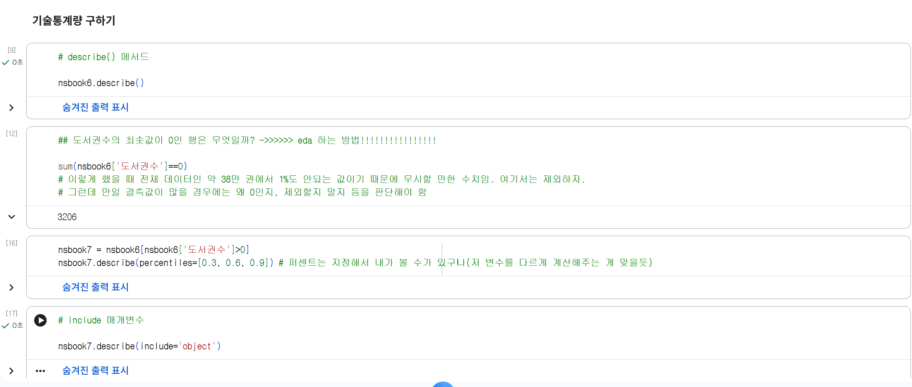
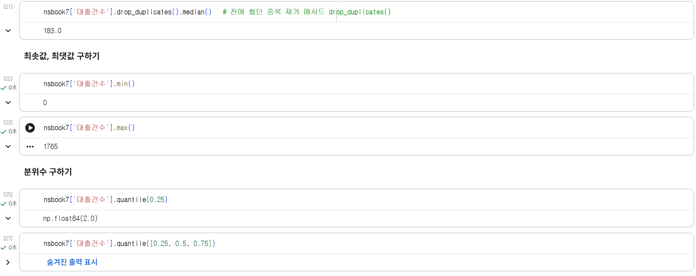
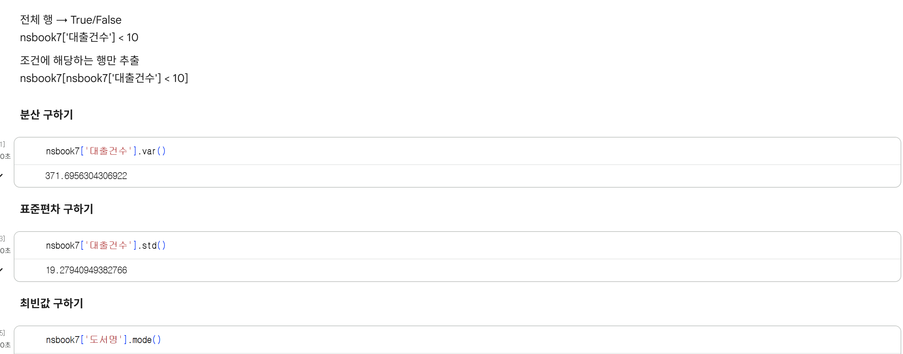
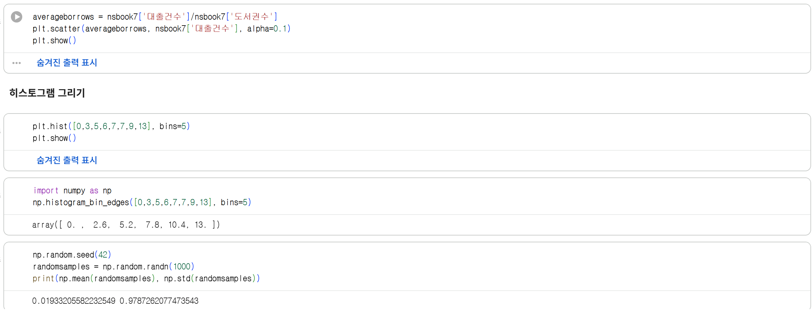

# 데이터분석 4주차 정규과제

📌데이터분석 정규과제는 매주 정해진 분량의 『*혼자 공부하는 데이터 분석 with 파이썬*』 을 읽고 학습하는 것입니다. 이번 주는 아래의 **DataAnalysis_4th_TIL**에 나열된 분량을 읽고 공부하시면 됩니다.

아래의 문제를 풀어보며 학습 내용을 점검하세요. 문제를 해결하는 과정에서 개념을 스스로 정리하고, 필요한 경우 제시된 강의를 참고하여 보완하는 것이 좋습니다.

<!-- 강의 링크는 아래와 같습니다.
https://www.youtube.com/watch?v=HNlRYQnLkek&list=PLVsNizTWUw7FGzSRCkQrPEEe-ljVXgS7k&index=8
https://www.youtube.com/watch?v=Cbk_tQtuhbM&list=PLVsNizTWUw7FGzSRCkQrPEEe-ljVXgS7k&index=9
-->


## DataAnalysis_4th_TIL

### 4장 데이터 요약하기
#### 01. 통계로 요약하기
#### 02. 분포 요약하기


## Study Schedule

| 주차  | 공부 범위     | 완료 여부 |
| ----- | ------------- | --------- |
| 1주차 | p.24~81    | ✅         |
| 2주차 | p.84~151   | ✅         |
| 3주차 | p.154~219  | ✅         |
| 4주차 | p.222~279 | ✅         |
| 5주차 | p.282~325 | 🍽️         |
| 6주차 | p.328~379 | 🍽️         |
| 7주차 | p.382~430 | 🍽️         |

<br>

<!-- 여기까진 그대로 둬 주세요-->


# 1️⃣ 개념 정리 

## 01. 통계로 요약하기

**기술통계**(요약통계) = 정량적인 수치로 전체 데이터의 특징을 요약하거나 이해하기 쉬운 간단한 그래프를 자용해 자료의 내용을 압축 및 설명하는 방법         
**통계량**: 평균, 표준편차 등           
**탐색적 데이터 분석** = 데이터 시각화를 아우르는 이러한 데이터 분석 방법      

---

### 기술통계량 구하기

**describe() 메서드** = 기본적인 수치형 열에 대한 요약 통계를 보여줌      
ex. nsbook6.describe()    
- count: 누락된 값 제외 데이터 개수    
- mean: 평균     
- std: 표준편차  
- min: 최솟값
- 50%: 중앙값
- 25% / 75%: 순서대로 늘어 놓았을 때 해당 지점 -> **(percentiles=[0.n])**해서 지정 가능한 듯
- max: 최댓값

**include 메서드**    
ex. nsbook7.describe(include='object')    
하게 되면, 데이터 타입의 기술통계 말고 object 타입의 기술통계 볼 수 있음
- count
- unique: 고유한 값의 개수 (중복 제거 후)
- top: 가장 많이 등장하는 값
- freq: top 행에 등장하는 항목의 빈도수

### 평균 구하기

**range() 함수** = 하나의 숫자를 입력할 경우 0부터 입력된 숫자 직전까지 반복할 수 있는 객체 생성     
ex.   
for i in range(3)     
    sum += x[i] 하게 되면        
-> range(3) 의 0, 1, 2가 i에 들어가게 되고, sum에 따라 더해진다.    

**mean() 메서드** - 평균 내고 싶은 항목에 대해 ex. nsbook7['대출건수'].mean()    

### 중앙값 구하기

**median() 메서드** - 중앙값 구하고 싶은 항목에 대해 ex. nsbook7['대출건수'].median()       
-> 데이터가 짝수인 경우에는 가운데 2개를 평균한 값으로 계산    
-> 중복값 제거하고 중앙값 구하기: nsbook7['대출건수']**.drop_duplicates()**.median()  

### 최솟값, 최댓값 구하기 (+ 백분위 구하기)

**min() 메서드** - 최솟값 ex. nsbook7['대출건수'].min()     
**min() 메서드** - 최댓값 ex. nsbook7['대출건수'].max()      

### 분위수 구하기 
백분위수(percentile), 사분위수, 제1사분위수(25%), 제2사분위수(중앙값), 제3사분위수(75%)     

**quantile() 메서드** - 사분위수 지정 ex. nsbook7['대출건수'].quantile(0.25) / 여러개이면? quantile([0.25, 0.5, 0.75])    

### 분산 구하기

**분산** = 평균으로부터 데이터가 얼마나 퍼져있는지를 나타내는 통게량      
-> 가운데 모여있다면 분산이 작고, 넓게 퍼져있다면 분산이 큼      
-> (제곱의 평균) - (평균의 제곱)     

**var() 메서드** - ex. nsbook7['대출건수'].var()    

### 표준편차 구하기

**표준편차** = 분산에 제곱근을 한 것  

**std() 메서드** - ex. nsbook7['대출건수'].std()   

### 최빈값 구하기

**mode() 메서드** - nsbook7['도서명'].mode() / 문자열에도 수치형에도 모두 ok   

---

### 넘파이의 기술통계 함수

- 평균 구하기: np.mean() &    
  **np.average()** -> 가중평균 계산 시 활용 ex. np.average(nsbook7['대출건수'], **weights=1/nsbook['도서건수']**)
- 중앙값 구하기: np.median()
- 최솟값, 최댓값 구하기: np.min() / np.max()
- 분위수 구하기: np.quantile()
- 분산 구하기: np.var()   
  -> 판다스는 표본집단 기준(n-1)인 반면 넘파이는 모집단(n) 기준임.     
  -> **ddof 매개변수로 자유도 바꿔줄 수 있음     
  ex. nsbook7['대출건수].var(ddof=0) - 판다스 ver.     
        np.var(nsbook7['대출건수], ddof=1) - 넘파이 ver.
- 표준편차 구하기: np.std()
- 최빈값 구하기: np.unique()


## 02. 분포 요약하기

데이터를 그림으로 요약하자!!   
-> 산점도, 히스토그램, 상자 수염 그림

---

### 산점도 그리기

**산점도** = 데이터를 화면에 뿌리듯 그리는 그래프 / 두 변수 혹은 두 가지 특성값을 직교 좌표계에 점으로 나타내는 그래프

=> 를 그리는데 matplotlib(맷플롯립)이 필요하다. 
 
**scatter() 함수** = 산점도를 그리는 함수   
**show() 함수** = 그래프 출력   
ex.     
plt.scatter(nsbook7['도서권수'], nsbook7['대출건수']) - plt.scatter(x축 좌표, y축 좌표)     
plt.show()

**alpha 매개변수** - 투명도 조절 ; 데이터가 많이 중첩된 부분은 짙게   
ex. plt.scatter(nsbook7['도서권수'], nsbook7['대출건수'], alpha=0.1)  
-> 0에 가까울수록 투명, 1에 가까울수록 불투명

### 히스토그램 그리기

**히스토그램** = 수치형 특성의 값을 일정한 **구간**으로 나누어 구간 안에 포함된 데이터 개수를 막대 그래프로 그린 것 (구간 내 데이터 개수 = **도수** -> 도수분포표!!)

**hist() 함수** = 히스토그램을 그리는 함수    
**bins 매개변수** - 구간을 나눔
ex.   
plt.hist(nsbook7['대출건수'])
plt.show() - 얘는 동일 걍

#### !!! 구간 조정 - 로그 스케일 !!!

= 로그 함수를 적용     
-> 큰 값일수록 도수 크기가 많이 줄어들어 작은 값과의 차이가 준다

**yscale() 함수에 'log' 지정** - ex. plt.yscale('log')   
**xcale() 함수에 'log' 지정** - ex. plt.xscale('log')

### 상자 수염 그림 그리기 - 박스플롯

**IQR** = 제1사분위수와 제3사분위수 사이의 거리

**boxplot()** = 박스플롯 그리는 함수     
**vert 매개변수** - 박스플롯을 수평으로 그리기     
**whis 매개변수** - 수염길이 조정하기     
(기본값 1.5 -> IQR n배 범위 내로 / (0,100)으로 지정 해서 백분율로 범위 지정도 가넝)    
ex.     
plt.boxplot(nsbook7[['대출건수','도서권수']], vert=False, whis=10)    
plt.xscale('log')   
plt.show()   

---

### 넘파이의 그래스 함수

- 산점도 그리기: 칼럼.plot.scatter(x축,y축,alpha=0.1) 후 plt.show()
- 히스토그램 그리기: 칼럼.plot.hist(bins=100) 후 plt.show()
- 박스플롯 그리기: 칼럼.boxplot() 후 plt.show()

<br>
<br>

# 2️⃣ 수행 인증

<!-- 교재에서 안내된 과정을 직접 실행해본 뒤, 진행 결과가 보이도록 3장 이상의 스크린샷을 캡처하여 아래에 첨부해주세요.-->







<br>
<br>

# 3️⃣ 확인 문제

## 문제 1.

> **🧚Q. 이번 주차에는 확인문제 대신 실습 과제를 진행합니다. 캐글에서 원하는 데이터셋을 선택하여 기술통계를 계산하고, 다양한 시각화를 수행해보세요.
작업은 코랩에서 진행한 뒤, 코랩 링크를 아래에 첨부해주세요.**

```
여기에 코랩 링크를 첨부해주세요!
(제출 전, 코랩의 공유 설정을 ‘링크가 있는 모든 사용자가 보기 가능’으로 변경했는지 반드시 확인해주세요.)
```
[week4 실습 과제 코랩 링크](https://colab.research.google.com/drive/1loKOQdonIEsVGP85hgPHAf3OepNDtPcq?usp=sharing)


### 🎉 수고하셨습니다.
