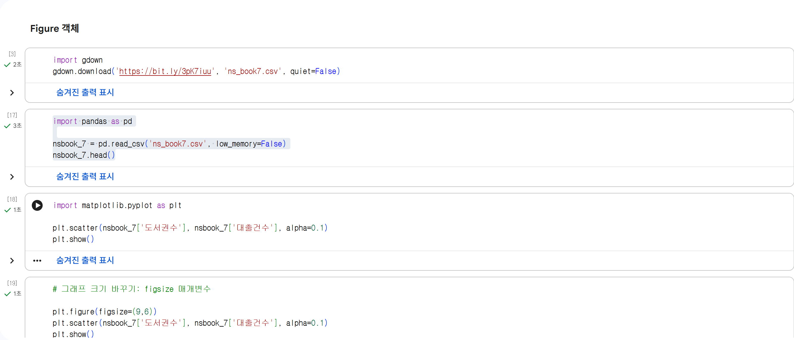
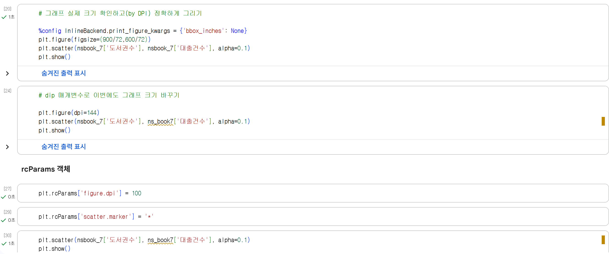
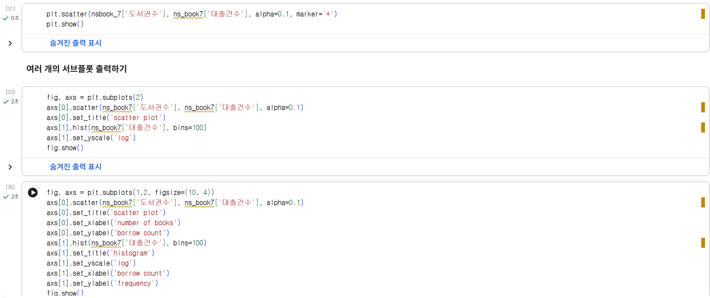
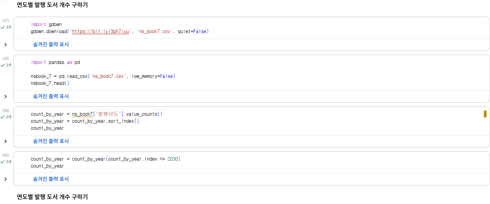
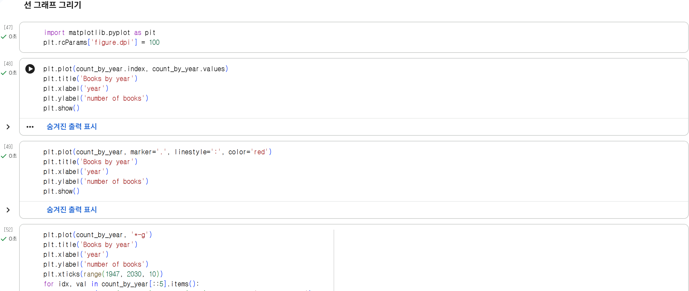
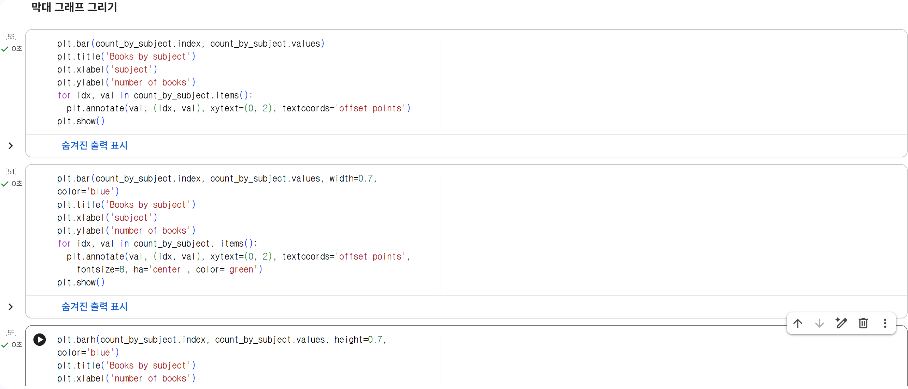

# 데이터분석 5주차 정규과제

📌데이터분석 정규과제는 매주 정해진 분량의 『*혼자 공부하는 데이터 분석 with 파이썬*』 을 읽고 학습하는 것입니다. 이번 주는 아래의 **DataAnalysis_5th_TIL**에 나열된 분량을 읽고 공부하시면 됩니다.

아래의 문제를 풀어보며 학습 내용을 점검하세요. 문제를 해결하는 과정에서 개념을 스스로 정리하고, 필요한 경우 제시된 강의를 참고하여 보완하는 것이 좋습니다.

<!-- 강의 링크는 아래와 같습니다.
https://www.youtube.com/watch?v=ho0LZ6GWhtc&list=PLVsNizTWUw7FGzSRCkQrPEEe-ljVXgS7k&index=10
https://www.youtube.com/watch?v=deYY4xHsI0o&list=PLVsNizTWUw7FGzSRCkQrPEEe-ljVXgS7k&index=11
-->


## DataAnalysis_5th_TIL

### 5장 데이터 시각화하기
#### 01. 맷플롯립 기본 요소 알아보기
#### 02. 선 그래프와 막대 그래프 그리기


## Study Schedule

| 주차  | 공부 범위     | 완료 여부 |
| ----- | ------------- | --------- |
| 1주차 | p.24~81    | ✅         |
| 2주차 | p.84~151   | ✅         |
| 3주차 | p.154~219  | ✅         |
| 4주차 | p.222~279 | ✅         |
| 5주차 | p.282~325 | ✅         |
| 6주차 | p.328~379 | 🍽️         |
| 7주차 | p.382~430 | 🍽️         |

<br>

<!-- 여기까진 그대로 둬 주세요-->


# 1️⃣ 개념 정리 

## 01. 맷플롯립 기본 요소 알아보기

그래프를 예쁘게 정확하게 표현해보자:   
맷플롯립 그래프와 피규어, rcParams, 서브플롯    


### Figure 객체

> - scatter() 함수로 산점도 그릴 때는 자동으로 피겨 객체가 생성됨
> - 근데 figure() 함수로 명시적으로 피겨 객체 만들어서 활용하면 다양한 그래프 옵션을 조절할 수 있다네
>
>**plt.figure()** = 피겨 객체 만들어서 그래프 옵션을 조절하자
>
>**figsize 매개변수** = 튜플로 그래프의 크기를 지정하기   
>-> 튜플 = 소괄호()로 표현하고, 리스트와 비슷하게 생김. 튜플 객체는 한번 생성하면 삭제하거나 수정 불가   
>ex. plt.figure(figsize=(9,6))   
>- 기본 그래프의 크기는 (6,4) -> 숫자 변경해서 크기 조절
>- DPI 확인 후 600/72 등으로 정확하게 크기 설정 가능
>- '%config InlineBackend.print_figure_kwargs = {'bbox_inches': None}' 선 작성으로 공백을 최소화 / 'tight'로 다시 백(~지금까지 계속 크기 키워오기 작업)
>
>**dpi 매개변수** - 로 그래프 크기 바꾸기 (figsize는 기본값 그대로)   
>ex. plt.figure(dpi=144) ; 방법은 같다   

### rcParams 객체

>- 맷플롯립 그래프의 기본값을 관리하는 객체 
>- 출력 뿐만 아니라 값 자체를 바꾸고, 이후에 그려지는 모든 그래프에 바뀐 설정이 적용됨
>
>**marker 매개변수** = 그래프의 마커 속성 확인/지정   
>ex. plt.scatter(nsbook_7['도서권수'], ns_book7['대출건수'], alpha=0.1, marker='+') 

### 여러 개의 서브플롯 출력하기

>- 하나의 피겨 객체 안에는 여러 개의 서브플롯을 담을 수 있음
>- 서브플롯 = Axes 클래스의 객체 
>- 하나의 서브플롯은 두 개 이상의 축을 포함; 눈금/틱이 표시됨; 축의 이름 = 레이블   
>
> **subplots()** = 원하는 서브플롯 개수를 지정해서 그리자   
>ex. fig, axs = plt.subplots(2) ; 이후에 axs[0] 해서 옵션 설정 고고
> -> 0 넣으면 첫 번째 그래프, 1 넣으면 두 번째 그래프 대상...  
>
> 여러 개 넣을 때 **가로**로 넣기   
> ex. fig, axs = plt.subplots(**1,2,** figsize=(10, 4))
>
>**set_title() 메서드** = 제목 넣기   
> ex. axs[0].set_title('scatter plot')   
>**set一xlab이() 메서드와 set一ylab이0 메서드** = x, y축 이름 넣기   
> ex. axs[0].set_xlabel('number of books')   
>   axs[0].set_ylabel('borrow count')


## 02. 선 그래프와 막대 그래프 그리기

- 선 그래프 = 데이터 포인트 사이를 선으로 이은 그래프
- 막대 그래프 = 데이터 포인트의 크기를 막대 높이로 나타내는 그래프   

산점도(전체 데이터의 형태를 가늠) vs 선/막대(한 축을 따라 어떤 데이터의 변화를 가늠)

**value_counts() 메서드** = 한 열에서 고유한 값의 등장 횟수를 계산    
ex. count_by_year = ns_book7['발행년도'].value_counts()

### 선 그래프 그리기

>**plt.plot()** = 선 그래프 그리기
>
>**linestyle 매개변수** = 선 모양을 지정   
> - 실선: '-'
> - 점선: ':'
> - 쇄선: '_.'
> - 파선: '--'
>
>**color 매개변수** = 색 지정 by 컬러코드/색상명   
>marker 매개변수도 사용 가능   
> -> plt.plot(count_by_year, marker='.', linestyle=':', color='red')를 pit.plot (count_by_year, ‘.:r')로 쓸 수 있음(축약 가능)
>
>**annotate() 함수** = 그래프의 특정 위치에 텍스트 추가   
>ex. plt.annotate(val, (idx, val)) 처럼 (그래프에 나타낼 문자열, 텍스트가 나타날 x,y 좌표) 형태로 작성
>
>- **xytext 매개변수** = 텍스트의 위치 기본 조정   
>- **textcoords 매개변수** = 그래도 안되면 상대적 위치로 포인트 지정  
> ex. plt.annotate(val, (idx, val), xytext=(2, 2), textcoords='offset points') 

### 막대 그래프 그리기

>**plt.bar()** = 막대 그래프 그리기
>
>- annotate() 함수
>   - **ha 매개변수** = 텍스트의 정렬(각 막대의 값)
>   - **fontsize 매개변수** = 텍스트 크기 조정
>   - color 매개변수
>
>- **width 매개변수** = 막대의 두께 조절(기본값 0.8)
>
>**plt.barh()** = 가로 막대 그래프 그리기(x,y축 이름 바꿔야댐..)
>
>- **height 매개변수** = 가로 막대 그래프용 막대의 두께 설정
>- **va 매개변수** = 가로 막대 그래프용 텍스트 정렬 ...


# 2️⃣ 수행 인증









<br>
<br>

# 3️⃣ 확인 문제

## 문제 1.

> **🧚Q. 다음 데이터를 이용하여 matplotlib으로 선그래프를 그리는 코드를 작성해주세요.**
- x = [1, 2, 3, 4, 5]
- y = [2, 4, 6, 8, 10]
> 조건은 아래와 같습니다.
```
1️⃣ 제목은 "Linear Trend"로 설정해주세요.
2️⃣ x축 이름은 "X values"로 설정해주세요.
3️⃣ y축 이름은 "Y values"로 설정해주세요.
4️⃣ 마커(marker)를 포함하여 선그래프를 그려주세요.
```

```
import matplotlib.pyplot as plt

x = [1, 2, 3, 4, 5]
y = [2, 4, 6, 8, 10]

plt.plot(x, y, marker = '*', color = 'orange')
plt.title('Linear Trend')
plt.xlabel('X values')
plt.ylabel('Y values')
plt.show()
```


### 🎉 수고하셨습니다.
